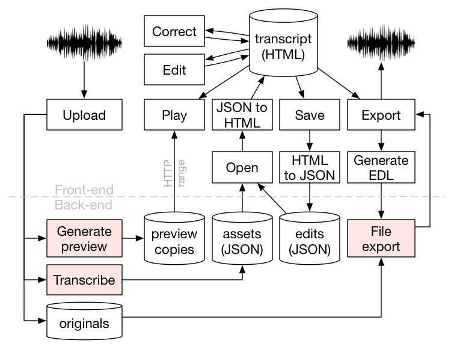

# Dialogger 

Dialogger is an audio/video editor that allows you to navigate and edit recordings using a text-based interface.

### What's included
* Playback and navigation using transcript
* Transcript editing
* Export of edit decision list (EDL)
* User accounts
* Asset management

### What's *not* included
The following features must be added manually for Dialogger to operate fully. Instructions and examples are provided.

* Speech-to-text
* Preview file generator
* File export

<p align="center">
  <br />
  <i>Conceptual flow diagram (excluded features shown in red)</i>
</p>

## Technology stack

#### Front-end

* HTML/CSS/JS
* Text editing: [CKEditor](http://ckeditor.com/) (LGPL)
* Media playback: [HTML5 Video Compositor](https://github.com/bbc/html5-video-compositor) (Apache-2.0)
* UI framework: [Semantic UI](https://semantic-ui.com/) (MIT)
* MVC framework: [Backbone](http://backbonejs.org/) (MIT)
* File upload: [Dropzone](http://www.dropzonejs.com/) (MIT)

#### Back-end

* Node.js / Express
* Database: [MongoDB](https://www.mongodb.com/) (Apache-2.0)
* Authentication: [Passport.js](http://passportjs.org/) (MIT)
* Media info: [Mimovie](https://github.com/rodrigopolo/mimovie) (MIT)
* Logging: [Bunyan](https://github.com/trentm/node-bunyan) (MIT)

## Installation

### Using Docker (recommended)

    git clone --recursive https://github.com/bbc/dialogger.git && cd dialogger
    docker-compose build
    docker-compose up

Navigate to `http://localhost:8080` and log in with username `user` and password `password`.

### Ubuntu/Debain

    git clone --recursive https://github.com/bbc/dialogger.git && cd dialogger
    curl -sL https://deb.nodesource.com/setup_6.x | sudo -E bash -
    sudo -E apt-get install -y nodejs mediainfo mongodb
    sudo -E npm install -g gulp bower bunyan
    npm install
    npm run build
    (cd data && ./import.sh)

In `config/consts.js`, set the following parameters:

* `consts.port`
* `consts.db.url`
* `consts.cookie.serverDomain`
* `consts.cookie.serverPath`
* `consts.files.root` (ensure write permissions are set)

Run Dialogger using `npm start`, then log in with username `user` and password `password`.

## Configuration

Dialogger does not include the following key functionality, so you must add this in manually. Instructions on how to
add this are provided below.

1. Speech-to-text
1. Preview file generator
1. File export

### 1. Speech-to-text 

Dialogger does not come with a speech-to-text system, so you will need to add some code to `helpers/stt.js` that
accepts a path to an audio/video file and returns the transcript and segmentation data.
Examples of the data formats are shown below, and an example can be found in `helpers/stt-example.js`.

#### Transcript format

```javascript
{
  words: [
    {
      word: "hello",
      punct: "Hello",
      start: 0.05,
      end: 0.78,
      confidence: 0.45
    },
    {
      word: "world",
      punct: "world.",
      start: 1.13,
      end: 1.45,
      confidence: 0.9
    }
  ]
}
```

#### Segments format

```javascript
{
  segments: [
    {
      start: 0.05,
      duration: 2.34,
      speaker: {
        @id: "Bob",
        gender: "M"
      }
    },
    {
      start: 2.34,
      duration: 4.2,
      speaker: {
      @id: "Alice",
        gender: "F"
      }
    }
  ]
}
```

### 2. Preview file generator
Preview files are low-bitrate versions of media files which are used for playback in the browser interface. To
configure preview file generation, you will need to add some code to `helpers/previewfile.js`. The function should
receive options in the following format, create a preview file and run the callback function. 

#### Options format

```javascript
{
  inputPath: "/path/to/input/file",
  outputPath: "/path/to/preview/version",
  format: "audio",  // can be audio or video
  audio: {
    acodec: "aac",
    ab: "128k"
  }    
}
```

### 3. File export
File export allows users to download an edited version of their media. To configure file export, you will need to add
some code to `helpers/fileexport.js`. The function should receive options in the following format and return the path
of the edited file. In essence, what you want to do is to take the file path (*asset.path*) and the list of edits
(*edl*), produce an edited version of the file, then return the path.

#### Options format

```javascript
{
  // Information about the original file/asset
  asset: {
    description: "Asset description",
    filename: "AssetFilename.wav",
    path: "/path/to/original/file",
    audio: {
      channels: 2,
      sampleRate: "48000"
    }
  },
  
  // An array of in- and out-points, in seconds
  edl: [
    ["78.38","102.89"],
    ["128.3","135.17"]
  ],
  
  // User-provided options from the exportForm
  //   in public/js/editor.html
  settings: {
    audio: {
      ab: "",
      acodec: "pcm_s16le"
    },
    edlformat: "dira",
    exportUnderlined:"true",
    format: "audio",
    id: "",
    include: "true",
    name: "test.wav",
    video: {
      height: "",
      vb: "",
      f: "mp4",
      acodec: "aac",
      ab: "",
      vcodec: "libx264",
      width: ""
    }
  }
}
```

## Issues/development

Please report any problems or make feature requests by **[raising an issue](./issues/new)**.
Pull requests are also welcome.

## Authors

* Chris Baume, BBC Research and Development
